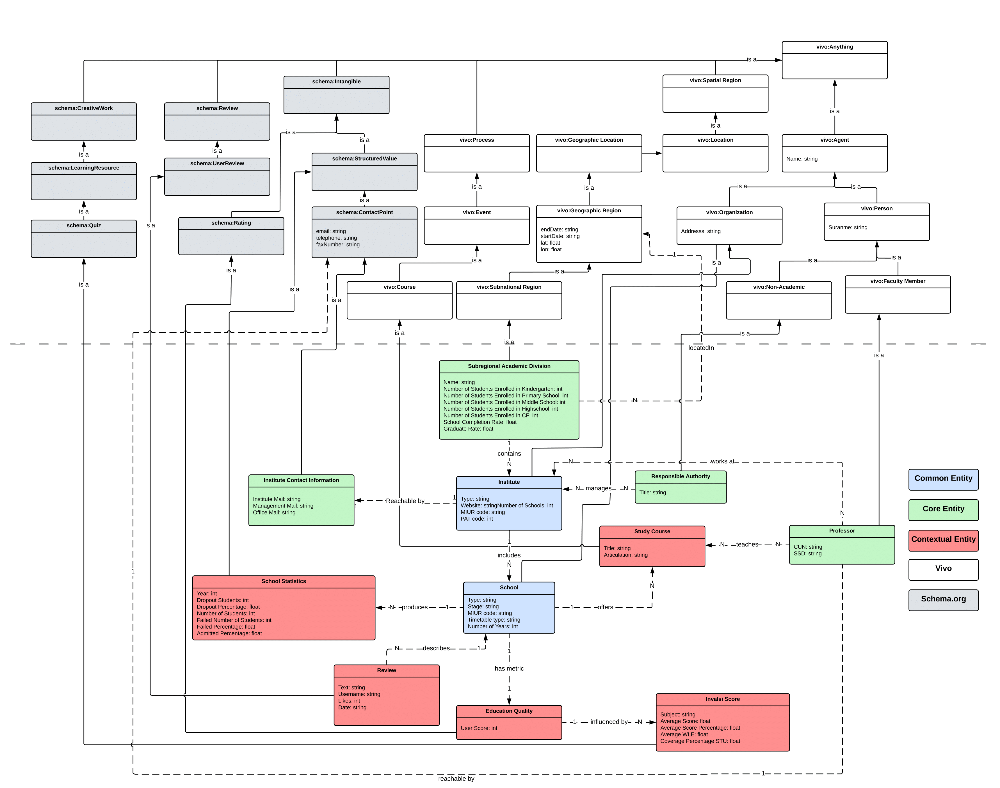

This project was developed by Samuele Bortolotti and Erich Robbi for the *Knowledge Graph Engineering* course of the master's degree in Computer Science at University of Trento.

# Project Description
Reusability is one of the main principles in the Knowledge Graph Engineering (KGE) process
defined by [*iTelos*](https://doi.org/10.48550/ARXIV.2105.09418). 

## Background
Through the employment of new techniques and equipment, companies are producing an unprecedented volume of data. 
Thanks to such resources it is possible to resolve complicated issues leveraging knowledge acquisition, by gaining access and reusing this data, appropriately adjusted for secondary needs.

However, the available data is frequently not easily accessible, and even when it is, it cannot be used outside of the purpose for which it was produced.

Indeed, among the resources, we can identify three categories, which are strictly connected to the relevance for the purpose itself: **Core**, **Common**, and **Contextual resources**.

- **Common resources** are not directly relevant to the user’s purpose but are fundamental to support it since they include knowledge that is shared across several domains of interest.
- **Core resources** do not convey knowledge on the most crucial aspects related to the purpose; however, without this knowledge, the service cannot be delivered.
- **Contextual resources** include particular, sometimes exclusive data pertaining to the purpose and for this reason, they are the less reusable ones.

*iTelos* is a general-purpose methodology that aims at providing a possible solution to the resources re-usability problem by developing independently the data level and the schema level of the resources. To fulfill its objective, *iTelos* uses ontologies, in order to set a standard schema for the whole application, and Knowledge Graphs, a graph-structured data model to integrate data.

To support our work in re-usability, we have relied on the [FAIR](The FAIR Guiding Principles for scientific data management and stewardship) guiding principles. FAIR aim to make data Findable, metadata, and data should be easy to find for both humans and computers; Accessible, once the data is found the user has to know how to access it; Interoperable, the data need to interoperate with applications or workflows for analysis, storage, and processing; and finally Reusable, optimize the data re-use thought well-described metadata and data in order to be replicated and/or combined in different settings. 

The goal of this work is to provide a service that will make it easier to locate schools in the Trentino area, together with information about those schools and the courses they offer, based on criteria such as city, commune, school type, course length, and instructional activity schedules.

# Purpose
The initial, and thus informal, purpose which has been later formalized, is shown below:

<div align="center">
”A service that will facilitate the finding of schools, including details about the school
and courses offered, in the region of Trentino based on city, commune, school type,
course duration, and teaching activities schedules.”
</div>

## Domain of Interest
This research seeks to provide a complete analysis of the educational facilities in Trentino which
comprehend geospatial and temporal domains. Since it is possible to combine many domains to produce a newly composed domain that serves a specific purpose, domain composition has
become an important step that was undertaken to identify the project’s aim.

Setting the parameters under which the project’s material would be taken into consideration was crucial since Trentino’s educational system included a wide range of topics. Trentino has
a wide range of educational institutions, including public and private kindergartens, elementary schools, secondary schools, universities, and other vocational training facilities.

Moreover, the data we were able to gather spans the years 2014 through 2022. 

However, we have sufficient recent data to assert that our temporal domain refers to the last few years (2020 - 2022).

Furthermore, a crucial feature we want our system to provide is to define metrics in order to assess the quality of the education provided by an educational facility, such as the quality of the reviews, the rate of completion of compulsory schooling, the number of students who fail to pass the year per municipality.

As a result, after learning about the type of data that was already accessible, the project’s original goal was established as follows:

<div align="center">
“A service that will help parents and students to find schools, including details about
schools and courses offered, in the region of Trentino based on city, municipality,
school type, course duration, teaching activities schedules, contact information, and
education statistics”
</div>

# Datasets
This section comprehends the list of resources we have employed in order to build the final knowledge graph.
Keep in mind that all the resources were managed throughout the entire process in order to be aligned syntactically and semantically, hence, the cleaned datasets can be found in the GitHub repository.

| Data Source                                                                                                                    	| Format 	| Organization      	| Description                                                                                                                                                                                                                                                                                                                                                                                                                                                                 	| License                                                             	|
|--------------------------------------------------------------------------------------------------------------------------------	|--------	|-------------------	|-----------------------------------------------------------------------------------------------------------------------------------------------------------------------------------------------------------------------------------------------------------------------------------------------------------------------------------------------------------------------------------------------------------------------------------------------------------------------------	|---------------------------------------------------------------------	|
| [Municipalities of Trentino](https://en.wikipedia.org/wiki/Municipalities_of_Trentino)                                         	| HTML   	| Wikipedia         	| This resource represents a list of municipalities of the autonomous province of Trento, Italy. In particular, it shows the [ISTAT code](https://en.wikipedia.org/wiki/Italian_National_Institute_of_Statistics), the name, the area, and the estimated population in 2001.                                                                                                                                                                                                  	| [CC Attribution v3.0](https://creativecommons.org/licenses/by/3.0/) 	|
| [Nidi di Infanzia](ttps://dati.trentino.it/dataset/nidi-dinfanzia2)                                                            	| CSV    	| OpenData Trentino 	| This resources contains the number of facilities of Nursery Schools which are present in each municipality of the autonomous province of Trento.                                                                                                                                                                                                                                                                                                                            	| [CC Attribution v4.0](https://creativecommons.org/licenses/by/4.0/) 	|
| [Scuole d'Infanzia](https://dati.trentino.it/dataset/scuole-dinfanzia2)                                                        	| CSV    	| OpenData Trentino 	| This resources contains the number of facilities of Kindergartens which are present in each municipality of the autonomous province of Trento.                                                                                                                                                                                                                                                                                                                              	| [CC Attribution v4.0](https://creativecommons.org/licenses/by/4.0/) 	|
| [Scuole Elementari](https://dati.trentino.it/dataset/scuole-elementari2)                                                       	| CSV    	| OpenData Trentino 	| This resources contains the number of facilities of Elementary Schools which are present in each municipality of the autonomous province of Trento.                                                                                                                                                                                                                                                                                                                        	| [CC Attribution v4.0](https://creativecommons.org/licenses/by/4.0/) 	  |
| [Scuole Medie superiori](https://dati.trentino.it/dataset/scuole-medie-superiori-e-centri-di-formazione-professionale2)        	| CSV    	| OpenData Trentino 	| This resources contains the number of facilities of High Schools which are present in each municipality of the autonomous province of Trento.                                                                                                                                                                                                                                                                                                                               	| [CC Attribution v4.0](https://creativecommons.org/licenses/by/4.0/) 	|
| [Scuole Medie inferiori](https://dati.trentino.it/dataset/scuole-media-inferiori2)                                             	| CSV    	| OpenData Trentino 	| This resources contains the number of facilities of Middle Schools which are present in each municipality of the autonomous province of Trento.                                                                                                                                                                                                                                                                                                                             	| [CC Attribution v4.0](https://creativecommons.org/licenses/by/4.0/) 	|
| [Insegnamenti e corsi di studio dell'Università di Trento](https://dati.trentino.it/dataset/insegnamenti-universita-di-trento) 	| JSON   	| OpenData Trentino 	| his dataset provides information about all the courses the University of Trento provides.                                                                                                                                                                                                                                                                                                                                                                                   	| [CC Attribution v4.0](https://creativecommons.org/licenses/by/4.0/) 	|
| [Istituzioni scolastiche del Trentino](https://dati.trentino.it/dataset/istituzioni-scolastiche-trentino)                      	| CSV    	| OpenData Trentino 	| The dataset contains information about all educational facilities presents in Trentino. The relevant information which are listed are the address, the name and the type.                                                                                                                                                                                                                                                                                                   	| [CC Attribution v4.0](https://creativecommons.org/licenses/by/4.0/) 	|
| [Corsi di studio scuole Trentine](https://dati.trentino.it/dataset/corsi-di-studio-delle-scuole-trentine)                      	| XML    	| OpenData Trentino 	| The resource concerns the courses each school in Trentino offers                                                                                                                                                                                                                                                                                                                                                                                                            	| [CC Attribution v4.0](https://creativecommons.org/licenses/by/4.0/) 	|
| [Invalsi Servizio Statistico Cineca](https://invalsi-serviziostatistico.cineca.it/)                                            	| CSV    	| CINECA            	| This dataset contains the average score of the [Invalsi tests](https://it.wikipedia.org/wiki/Prove_nazionali_INVALSI) per municipality. Their goal is to assess students' learning levels of Italian, Math, and English at critical points in the academic year.                                                                                                                                                                                                            	| [CC Attribution v4.0](https://creativecommons.org/licenses/by/4.0/) 	|
| [Google Reviews](https://developers.google.com/)                                                                               	| HTML   	| Google            	| This resource concerns the reviews that other people leave on points of interest around the world. They can give pretty meaningful information regarding how people have felt about a given school facility either concerning their education or the ones of others they know.                                                                                                                                                                                              	| [CC Attribution v3.0](https://creativecommons.org/licenses/by/3.0/) 	|
| [Istituto di Statistica della Provincia di Trento](https://statweb.provincia.tn.it/indicatoriStrutturaliSubPro/)               	| CSV    	| Provincia TN      	| This website contains all the resources which were collected and made available by the Statistical Institute of the Province of Trento (ISPAT). It provides several relevant information about Trentino and the cultural level of its inhabitants. In this project, we have employed this service for deepening our knowledge about the number of students per municipality and the information concerning the rate of completion of compulsory schooling per municipality. 	| [CC Attribution v4.0](https://creativecommons.org/licenses/by/4.0/) 	|
| [Unitrento Digital University](https://webapps.unitn.it/du)                                                                    	| JSON   	| Unitn             	| Information on the students, faculty, staff, and administration of the University of Trento can be found at the Digital University portal.                                                                                                                                                                                                                                                                                                                                  	| [CC Attribution v4.0](https://creativecommons.org/licenses/by/4.0/) 	|
| [Vivo Scuola](https://www.vivoscuola.it)                                                                                       	| HTML   	| Vivoscuola        	| Vivoscuola provides an integrated variety of services, information, and curiosity about schools to students, teachers, and parents                                                                                                                                                                                                                                                                                                                                          	| [CC Attribution v3.0](https://creativecommons.org/licenses/by/3.0/) 	| 

# Inception

The formalization of the project's objective and the domain is the first and most crucial step in the data integration process and the inception phase. The clarity of the project objective is a key factor in determining how the data integration process turns out.

In order to formulate a purpose, one must first define the project's domain of interest, personas, and scenarios involving those personas.

We have identified the domain of interest, and built 11 distinct personas and 10 various scenarios with a variety of features, with the subsequent definition of the competency questions.

All the personas, scenarios and competency questions are present within the project report and project repository. In the remaining part of this section, we show an example of persona, scenario and competency question.

| Persona | Personal Information | Differentiator |
|--------------------------------------------------------------------------------------------------------------------------|---------------------------------------------------------------------------------------------------------------------------------|--------------------------------------------------------------------------------------------------------------------------------|
|               | Age: 55 <br>Sex: Male<br>Occupation: worker<br>Driver: yes<br>Education: PhD         | Hermann is a 55-year-old man from Austria and he works as a senior researcher at Stanford University, United States. His research area is mostly focused on the importance of education and how to improve it during each stage of life. His latest work is carried out in collaboration with the European Schoolnet, which is an organization headquartered in Brussels, with the aim of innovating both education and learning in Europe. Therefore, as the first step for his work he has to collect basic information in regard of the educational activities that take place in all Europe, Trentino included. More specifically, he has to retrieve all details of the schools such as the school name, the country municipality, the courses that the school offers, and a reference contact in case of additional question  |


| Scenario | Description |
|--------------------------------------------------------------------------------------------------------------------------|--------------------------------------------------------------------------------------------------------------------------------|
|  | I am a student and I am looking for a school that would allow me not to quit my job. I am currently employed part-time and I cannot afford to quit my job to attend school full-time. I am looking for a school that has an online or evening program that would allow me to continue working while attending school. |

|  Persona ID    |  Scenario ID   | Competency Question | Common Entities | Core Entities | Contextual Entities |
| ------ | -------- | ---- | -------- | -------- | -------- |
| 6  | 6 | Give me the top rated kindergartens near Pergine Valsugana | Education Institute, School | Subregional Academic Division | Education quality, Review |

Finally, in this phase we have collected the first informal resources needed in order to build the final knowledge graph. All the resources can be found within the project repository.

# Informal modeling

The informal modeling step of *iTelos* is a crucial linking stage that allows us to create the fundamental *Etypes* and draws conclusions about their related attributes from competency questions.

The ER model is built using the retrieved *Etypes* and characteristics. There are two sections of the entire operation: the first one relates to the knowledge layer, while the other is concerned with the data layer. The knowledge layer’s critical step in this phase is intended to transform analyzed competency questions into classes and attributes.

The definition of the Competency Questions allowed us to define the following Entities:

- School
- School Statistics
- Region
- Institute
- Institute Contact Information
- Subregional Academic Division
- Responsible Authority
- Invalsi Score
- Study Course
- Contact Information
- Review
- Education Quality
- Professor

## ER Model


There are 13 classes (*Etypes*):

### Common Etypes

- Region
- School
- Contact Information
- Institute

### Core Etypes

- Professor
- Responsible Authority
- Subregional Academic Division
- Institute Contact Information
  
### Contextual Etype

- Review
- School Statistics
- Invalsi Score
- Study Course
- Education Quality

# Formal modeling

The third *iTelos* phase is Formal Modeling. In this phase, we are asked to build the ETG model
and to syntactically align the datasets for knowledge and data level using the ER model, the
selected datasets, and reference ontologies.

The goal of ontology selection is to identify relevant ontologies for reference, which represent
use-case scenarios that may be reused to model the ER.
To be more explicit, the initial stage in the ETG generation activity is to reuse ontology from
well-known knowledge resources that are semantically equivalent to concepts that are present in
the ER model defined in the previous phase. The most important element is to determine which
concepts such as objects, functions, and actions from existing ontologies may be connected
and aligned to the ER model. We have opted for [`VIVO`](http://liveschema.eu/dataset/graph/lov_vivo) as reference ontology with some Etypes borrowed from [`schema.org`](https://schema.org/).

## Teleontology



# ETG construction

The crucial phase in ETG construction is Entity matching, which is the last phase of the *iTelos* methodology. The aim is to determine whether several entities in the datasets can reflect the same real-world entity and, as a result, should be integrated into the final EG.

The key point of entity matching is to define each entity Identifying Set. An Identifying Set is a set of Etypes properties that uniquely identify an entity throughout the different datasets. The idea is that identifiers are not always included in datasets, thus, we should find those properties which allow us to uniquely identify an entity.

This procedure was conducted on *KarmaLinker*, which is a tool compliant with the *iTelos* methodology used for data integration. We can effectively match the datasets to the specified ontology using *KarmaLinker*. Hence, by defining each *Etype* URIs we completely address the semantic heterogeneity problem.

Once the mapping has been performed, *KarmaLinker* produces the RDF file for each EType, which can then be used in order to load data in *GraphDB*.

# Answer to the competency questions

The objective of this project is to integrate data and knowledge related to Trentino educational facilities into a knowledge graph so that users can use it to get the answers to their queries.
In compliance with the final objective, we used *SPARQL* via *GraphDB* to see whether our model can be applied to real-world scenarios. As evidenced by the outcomes of certain deployed instances, our model answers the queries in a satisfactory way. 

## Outcome exploitation

Here we provide a few examples regarding the *SPARQL* queries used to answer some of the competency questions:

### Give me the top-rated kindergartens in Trentino

```sparql
PREFIX rdf: <http://www.w3.org/1999/02/22-rdf-syntax-ns#>
PREFIX ds: <http://knowdive.disi.unitn.it/etype#>
select ?school_name ?municipality_name ?score where {
    ?municipality rdf:type ds:Subregional_Academic_Division_GID-300037  .
    ?institute rdf:type ds:Institute_GID-45425 .
        ?school rdf:type ds:School_GID-44778 .
    ?quality rdf:type ds:Education_Quality_GID-300039 .

    ?municipality ds:contains_GID-113311_Type-300037 ?institute .
    ?institute ds:includes_GID-101226_Type-45425 ?school .
    ?school ds:has_metric_GID-300001_Type-44778 ?quality .
    
    ?municipality ds:has_Name_GID-2_Type-300037 ?municipality_name .
    ?institute ds:has_Type_GID-31834 ?type .
    ?school ds:has_Name_GID-2_Type-300037 ?school_name .
    ?quality ds:has_User_Score_GID-31336_Type-300039 ?score .
    FILTER(?type = "Kindergarten")
} order by desc(?score) LIMIT 10	
```

### Give me % of student that abandoned a particular institute

```sparql
PREFIX rdf: <http://www.w3.org/1999/02/22-rdf-syntax-ns#>
PREFIX ds: <http://knowdive.disi.unitn.it/etype#>
select ?institute_name ?year ?dropout_number_of_students ?dropout_percentage where {
    ?institute rdf:type ds:Institute_GID-45425 .
    ?school rdf:type ds:School_GID-44778 .
    ?statistics rdf:type ds:School_Statistics_GID-300043 .
    
    ?institute ds:includes_GID-101226_Type-45425 ?school .
    ?school ds:produces_GID-108406_Type-44778 ?statistics.

    ?institute ds:has_Name_GID-2_Type-300037 ?institute_name .
    ?school ds:has_Name_GID-2_Type-300037 ?school_name .
    ?statistics ds:has_Year_GID-80974_Type-300043 ?year .
    ?statistics ds:has_Dropout_Students_GID-300013_Type-300043 ?dropout_number_of_students .
    ?statistics ds:has_Dropout_Percentage_GID-300015_Type-300043 ?dropout_percentage .
} order by ?year desc(?dropout_percentage)
```

# Resources
In this section, we present the list of resources which can be consulted in order to know more about the project.

## Authors
Here you can find the contact information in order to get in touch with us:

|  Name    |  Surname   | Github Username                                             |
| :------: | :--------: | :---------------------------------------------------------: |
| Samuele  | Bortolotti | [`samuelebortolotti`](https://github.com/samuelebortolotti) |
| Erich    | Robbi      | [`erich-r`](https://github.com/erich-r)                     |


## GitHub repository
All the materials, concerning the Personas, Competency Questions, Ontologies, Teleology, Teleontology, KG and *SPARQL* queries are listed below:

## Google Drive folder

Link: [Google Drive Folder](https://drive.google.com/drive/folders/1X7iKpIhawEzTfQhQWdEJWfbMpVyZ6xl_?usp=share_link)

## Project Report

## Project Presentation
